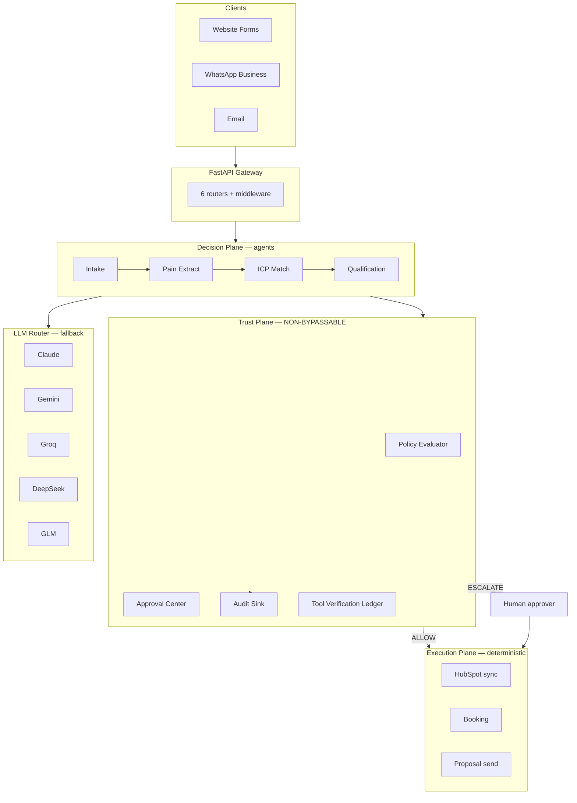

<div align="center">

# 🏢 Dealix — AI Company Saudi

### Sovereign, policy-governed Growth & Execution OS for Saudi enterprises
### نظام نمو وتنفيذ سيادي محكوم بالسياسات، للشركات السعودية

[](https://github.com/VoXc2/dealix/actions/workflows/ci.yml)
[](LICENSE)
[](https://www.python.org/downloads/)
[](https://fastapi.tiangolo.com/)
[](tests/)
[](docs/architecture/API_MAP.md)

**[العربية](README.ar.md)** · **English**

### [🚀 Deploy Now](docs/ops/DEPLOY_NOW.md) · [📦 .env Template](.env.example) · [🎯 Landing](landing/) · [🗺️ API Map](docs/architecture/API_MAP.md) · [🏢 Day 1 Plan](docs/business/FIRST_100_TARGETS_PLAN.md)

---

## 🎯 What's in this repo

**Backend** — FastAPI + SQLAlchemy 2.0 async + Postgres. 13 routers / 102 endpoints. See [API_MAP.md](docs/architecture/API_MAP.md).

**Lead Machine** — Provider adapter chains for Search / Maps / Crawler / Tech / EmailIntel that fall back gracefully when env keys are missing. See [PROVIDER_ADAPTERS.md](docs/architecture/PROVIDER_ADAPTERS.md).

**Data Lake + Lead Graph** — 7-table compliant ingestion: `raw_lead_imports → raw_lead_rows → accounts → contacts → signals → lead_scores → data_suppression_list`. PDPL-aware (allowed_use, consent_status, opt_out, risk_level mandatory per row). See [DATA_LAKE_PLAYBOOK.md](docs/ops/DATA_LAKE_PLAYBOOK.md).

**Frontend** — Static landing on GitHub Pages + interactive dashboard with live Saudi Lead Engine demo. See [landing/](landing/).

**Day-1 Operating Kit** — 287 outreach-ready Saudi B2B accounts pre-built across 7 segments (real-estate / construction / hospitality / events / food / logistics / SaaS / agency). Pricing ladder + Pilot offer + Partner model + Channel templates. See [docs/business/](docs/business/).

</div>

---

## ⚡ Quick Deploy

Any Docker-capable platform works. See [DEPLOYMENT.md](DEPLOYMENT.md) for Railway, Render, Fly.io, Heroku, DigitalOcean, AWS, self-hosted.

```bash
# Local
docker build -t dealix .
cp .env.example .env  # edit with real values
docker run -p 8000:8000 --env-file .env dealix
curl localhost:8000/health
```

**Public endpoints (no auth):** `/health`, `/api/v1/public/demo-request`, `/api/v1/pricing/plans`, `/api/v1/checkout`, `/api/v1/webhooks/moyasar`

---

## 🌟 One-line definition

> **Dealix is a sovereign, policy-governed Growth & Execution OS for Saudi enterprises. It combines agentic intelligence, deterministic execution, approval controls, and executive observability to drive revenue, partnerships, expansion, and strategic operations with enterprise-grade trust.**

It is **not** a CRM, **not** a chatbot, **not** a sales automation tool.

## 🧭 The Prime Operating Rule

> **AI explores, analyzes, and recommends.**
> **Deterministic workflows execute.**
> **Humans approve critical moves.**

No agent makes an external commitment on its own. No critical output leaves the system without being **structured, evidence-backed, policy-evaluated**, and (where required) **human-approved**.

---

## 🧱 The six OS tracks

1. **Revenue OS** — lead to close, pipeline, forecasting
2. **Partnership OS** — partner discovery, joint pursuits, co-sell
3. **Corporate Development / M&A OS** — sourcing, diligence, integration
4. **Expansion OS** — new-market entry, localization
5. **PMI / Strategic PMO OS** — post-merger integration, cross-BU initiatives
6. **Trust, Policy & Executive Governance OS** — controls, approvals, risk, audit

---

## 🏗️ Five mandatory planes

Every feature lives in exactly one plane. Crossing planes happens via **contracts**, never via shared memory or direct calls.

| Plane | Responsibility | Module |
|---|---|---|
| **Decision** | Agents: reasoning, synthesis, recommendation, evidence assembly | `auto_client_acquisition/`, `autonomous_growth/`, `core/agents/` |
| **Execution** | Durable workflows, retries, compensation, external commitments | `auto_client_acquisition/pipeline.py`, `dealix/execution/` |
| **Trust** | Policy, approval, audit, tool verification, evidence packs | `dealix/trust/` |
| **Data** | Operational source of truth, semantic metrics, lineage | `db/`, `integrations/` |
| **Operating** | Repo governance, CI/CD, releases, SDLC security | `.github/`, `Dockerfile`, `Makefile` |

---

## 🛡️ What makes this Tier-1

### 1. Structured outputs with classifications
Every critical agent output is a validated `DecisionOutput` (Pydantic + JSON Schema) carrying:
- **Approval class** (A0–A3): who must approve
- **Reversibility class** (R0–R3): how hard to undo
- **Sensitivity class** (S0–S3): data/impact risk

### 2. Trust Plane as a non-bypassable overlay
Every NextAction runs through a `PolicyEvaluator` that returns `ALLOW` / `DENY` / `ESCALATE`. Escalations create `ApprovalRequest`s with TTL + multi-approver support. Every step is **audited**.

### 3. Never-auto-execute list
Hardcoded in `dealix/classifications/NEVER_AUTO_EXECUTE`: pricing commits, contract changes, NDAs, payment terms, regulator comms, sensitive data exports — these **cannot** bypass human approval, regardless of other signals.

### 4. Evidence packs on high-stakes decisions
A2+/R3/S3 decisions **cannot be constructed without evidence** — Pydantic validator enforces it. Every pack ships with sources, tool calls (intended vs actual), prompts used, model versions, and a bilingual AR/EN board-grade memo.

### 5. No-overclaim register
Every public product claim is tracked in [`dealix/registers/no_overclaim.yaml`](dealix/registers/no_overclaim.yaml) with status (`Production` / `Partial` / `Pilot` / `Planned`) and evidence paths.

### 6. Saudi-native from day one
Not localization — Gulf business register Arabic, SAR pricing tiers, Riyadh timezone awareness, PDPL lawful-basis enforcement via policy rules, NCA ECC/DCC/CCC mapping in [`dealix/registers/compliance_saudi.yaml`](dealix/registers/compliance_saudi.yaml).

---

## ✨ Core technical features

- 🧠 **Multi-LLM routing with fallback** — Claude, Gemini, Groq, DeepSeek, GLM, OpenAI. Task → best provider → auto-fallback on failure. Per-provider usage tracking.
- 🤖 **15+ production agents** — typed I/O, structured logging, graceful degradation, 63 tests.
- 🌍 **First-class bilingual AR/EN** — detection, routing (Arabic → GLM), content generation, sales scripts, docs.
- 🔒 **Security-first** — `.env`-only config, `SecretStr` everywhere, gitleaks + detect-secrets + trufflehog + bandit in pre-commit AND CI, webhook HMAC verification, non-root Docker, ToS-safe LinkedIn.
- 🐳 **Cloud-ready** — multi-stage Dockerfile, docker-compose stack (Postgres + Redis + Mongo), GitHub Actions CI/CD, GHCR image push on release tags.
- 📊 **Observable** — structlog JSON logs in prod, request IDs, per-provider LLM usage metrics, optional Langfuse integration.

---

## 🏗️ Architecture



Full blueprint: [`docs/blueprint/master-architecture.md`](docs/blueprint/master-architecture.md).

---

## 🚀 Quick start

```bash
git clone https://github.com/YOUR-ORG/ai-company-saudi.git
cd ai-company-saudi
make setup
# edit .env, then:
make run
# → http://localhost:8000/docs
```

Full stack (app + Postgres + Redis + Mongo):
```bash
make docker-up
```

### Try the governed pipeline

```bash
curl -X POST http://localhost:8000/api/v1/leads \
  -H "Content-Type: application/json" \
  -d '{
    "company": "شركة التقنية المتقدمة",
    "name": "أحمد محمد",
    "email": "ahmed@example.sa",
    "phone": "+966501234567",
    "sector": "technology",
    "region": "Saudi Arabia",
    "budget": 50000,
    "message": "نحتاج نظام AI لإدارة المبيعات"
  }'
```

### Use the GovernedPipeline directly (shows the governance layer)

```python
import asyncio
from dealix.execution import GovernedPipeline

async def main():
    gp = GovernedPipeline()
    result = await gp.run(payload={
        "company": "...",
        "name": "...",
        "message": "..."
    })
    print(f"Decisions: {len(result.decisions)}")
    print(f"Policy results: {len(result.policy_results)}")
    print(f"Approval requests: {len(result.approval_requests)}")
    print(f"Audit trail: {len(result.audit_trail)} entries")

asyncio.run(main())
```

---

## 📚 The twelve Master Documents

All under [`dealix/masters/`](dealix/masters/) and [`dealix/registers/`](dealix/registers/):

1. [Master Architecture Blueprint](docs/blueprint/master-architecture.md) — canonical source of truth
2. [AI Operating Constitution](dealix/masters/constitution.md) — binding rules
3. [Trust Fabric Specification](dealix/masters/trust_fabric_spec.md)
4. [Execution Fabric Specification](dealix/masters/execution_fabric_spec.md)
5. [Repo Operating Pack](dealix/masters/repo_operating_pack.md)
6. [90-Day Execution Matrix](dealix/registers/90_day_execution.yaml)
7. [Saudi Compliance Register](dealix/registers/compliance_saudi.yaml) — PDPL + NCA + AI governance
8. [Technology Radar](dealix/registers/technology_radar.yaml)
9. [Incident & Rollback Runbook](dealix/masters/incident_rollback_runbook.md)
10. [Release Readiness Checklist](dealix/masters/release_readiness_checklist.md)
11. [No-Overclaim Register](dealix/registers/no_overclaim.yaml) — every public claim tracked
12. [Evidence Pack Specification](dealix/masters/evidence_pack_spec.md)

---

## 🧪 Testing

```bash
make test              # 63 tests, all passing
```

Tests include: intake, ICP matcher, pain extractor, model router, API endpoints, full Phase 8 pipeline, **Dealix contracts (with high-stakes validation)**, **Trust Plane (policy + approval + audit + tool verification)**, **Governed pipeline end-to-end**.

---

## 🧰 Tech stack

| Layer | Choice | Status |
|---|---|---|
| Language | Python 3.11 / 3.12 | ADOPT |
| Framework | FastAPI 0.115 + Uvicorn | ADOPT |
| Validation | Pydantic v2 + pydantic-settings | ADOPT |
| Contracts | JSON Schema + CloudEvents 1.0 | ADOPT |
| DB | PostgreSQL 16 + pgvector | ADOPT |
| LLM | Claude, Gemini, Groq, DeepSeek, GLM, OpenAI fallback | ADOPT |
| Execution | In-process → LangGraph → Temporal spike | TRIAL→ADOPT |
| Trust — Policy | In-process → OPA/Rego | TRIAL |
| Trust — AuthZ | In-process → OpenFGA | TRIAL |
| Trust — Identity | local → Keycloak | TRIAL |
| Trust — Secrets | `.env` + SecretStr → Vault | TRIAL |
| Observability | structlog → OpenTelemetry | TRIAL |
| CI/CD | GitHub Actions + rulesets + OIDC | ADOPT |

Full radar: [`dealix/registers/technology_radar.yaml`](dealix/registers/technology_radar.yaml).

---

## 📊 Phase 8 — Acquisition agents

All 9 agents + pipeline. Every output lifts to a `DecisionOutput` via `dealix.contracts.builders`.

| Agent | Classification | Role |
|---|---|---|
| Intake | A0/R0/S2 | Multi-source lead capture, normalization, dedup |
| ICP Matcher | A0/R0/S1 | 5-dim weighted Fit scoring with tier A/B/C/D |
| Pain Extractor | A0/R0/S1 | Hybrid keyword + LLM pain extraction (AR+EN) |
| Qualification | A0/R0/S1 | BANT questions, status advancement |
| Booking | **A1**/R1/S2 | Calendly → Google Calendar → manual (requires approval) |
| CRM | A0→**A1**/R1/S2 | HubSpot contact upsert (A0) + deal create (A1) |
| Proposal draft | A0/R0/S2 | Claude-authored, region-aware pricing |
| Proposal send | **A2/R2**/S2 | Gated — requires manager + legal approval |
| Outreach | **A1**/R2/S2 | Bilingual cold openers — gated |
| Follow-up | **A1**/R2/S2 | Cadence-based — gated |

---

## 📈 Phase 9 — Growth agents

| Agent | Role |
|---|---|
| Sector Intel | 12 Saudi sectors with curated market size, growth, AI readiness |
| Content Creator | Bilingual articles, LinkedIn, case studies, newsletters |
| Distribution | Multi-channel scheduling (Riyadh timezone) |
| Enrichment | Domain + LLM-based lead enrichment |
| Competitor Monitor | Positioning, pricing hints, counter-moves |
| Market Research | Gemini-powered research with bullet findings |

---

## 🔒 Security

- `.env`-only config via `pydantic-settings`; `SecretStr` on every sensitive value
- Pre-commit: `gitleaks`, `detect-secrets`, `bandit`, `hadolint`
- CI: re-runs the above + `trufflehog` on every push and PR
- Webhook HMAC verification (WhatsApp)
- Non-root Docker container with healthcheck
- LinkedIn integration disabled by default (ToS compliance)
- See [SECURITY.md](SECURITY.md) for reporting vulnerabilities

---

## 🇸🇦 Saudi compliance

Designed from inception for:

- **PDPL** — lawful-basis register, retention schedule, breach response, DPO assessment, cross-border transfer posture
- **NCA ECC 2-2024** — Essential Cybersecurity Controls
- **NCA DCC-1:2022** — Data Cybersecurity Controls
- **NCA CCC 2:2024** — Cloud Cybersecurity Controls
- **NIST AI RMF 1.0** + **OWASP Top 10 for LLM Applications**

Full register: [`dealix/registers/compliance_saudi.yaml`](dealix/registers/compliance_saudi.yaml).

---

## 🤝 Contributing

See [CONTRIBUTING.md](CONTRIBUTING.md) and [Repo Operating Pack](dealix/masters/repo_operating_pack.md).
By participating you agree to the [Code of Conduct](CODE_OF_CONDUCT.md).

---

## 📜 License

MIT — see [LICENSE](LICENSE).

---

<div align="center">

**[📖 Blueprint](docs/blueprint/master-architecture.md)** · **[🛡️ Constitution](dealix/masters/constitution.md)** · **[📋 No-Overclaim Register](dealix/registers/no_overclaim.yaml)** · **[🇸🇦 Compliance](dealix/registers/compliance_saudi.yaml)**

</div>
