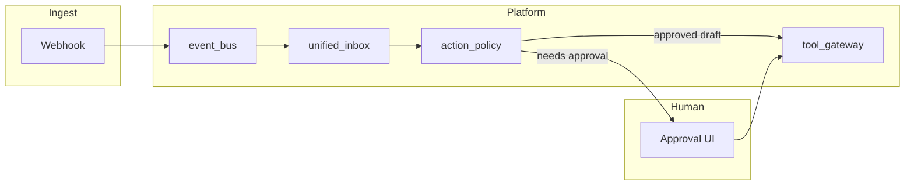

# Agent workflow architecture — Dealix (conceptual)

> **Scope:** تصميم مفاهيمي لمسارات وكلاء متينة **بدون** إضافة `langgraph` أو تبعيات تنفيذ معقدة إلى `requirements.txt` حتى موافقة صريحة على التكلفة والصيانة.

## الأهداف التشغيلية

1. **Durable execution:** إعادة تشغيل آمنة بعد انقطاع؛ حالة الخطوة محفوظة خارج الذاكرة فقط.
2. **Human-in-the-loop:** نقاط توقف عند الموافقة على إرسال خارجي، دفع، أو رسائل واتساب.
3. **Tracing:** ربط كل إجراء بـ `tenant_id`، `correlation_id`، ومسار القرار في `action_policy` / سجلات المنصة.

## طبقات حالية في الريبو

- **Innovation:** مسارات عرض و Kill features deterministic تحت `/api/v1/innovation/*`.
- **Platform Services:** سياسة + inbox + بوابة أدوات بدون live تحت `/api/v1/platform/*`.
- **Intelligence layer:** مخرجات JSON خفيفة تحت `/api/v1/intelligence/*`.

## مسار مقترح (مستقبلي)

## ماذا يضيف LangGraph لاحقاً (إن وُفقت)

- بيان حالة آلة صريح (nodes/edges) بدل سلاسل if طويلة.
- استئناف من عقدة بعد موافقة بشرية.
- دمج أدوات خارجية خلف نفس `tool_gateway` مع سياسات موحّدة.

## مخاطر التبني المبكر

- ازدواج مع منطق الـ API الحالي.
- تعقيد التشغيل والمراقبة قبل إثبات الـ MVP مع العملاء.

## المراجع الداخلية

- [`PLATFORM_SERVICES_STRATEGY.md`](PLATFORM_SERVICES_STRATEGY.md)
- [`INTELLIGENCE_LAYER_STRATEGY.md`](INTELLIGENCE_LAYER_STRATEGY.md)
- [`PRIVATE_BETA_RUNBOOK.md`](PRIVATE_BETA_RUNBOOK.md)
