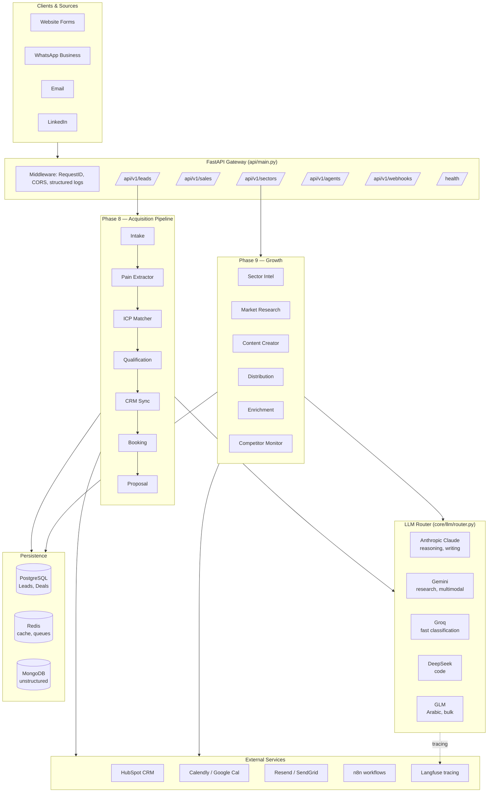

# Architecture | معمارية النظام

## System overview



## Key design decisions

### 1. `.env`-only configuration via `pydantic-settings`

All secrets live in `core/config/settings.py`, wrapped in `SecretStr`. No module may read env vars directly — they go through `get_settings()`. This keeps secrets centralized, typed, and out of application code.

### 2. Task → Provider routing with fallback

`core/config/models.py` declares a routing table mapping every `Task` enum value to a primary `Provider`, plus a fallback chain. The `ModelRouter` tries primary, then each fallback, recording usage metrics and fallback triggers. This means **any single LLM outage is non-fatal** for the system.

### 3. Agents share a common base class

`core/agents/base.py::BaseAgent` provides:
- A bound structlog logger with `agent`/`agent_id` context
- Access to the shared `ModelRouter`
- A robust `parse_json_response()` utility that handles fenced blocks, raw JSON, and messy LLM output

Every agent exposes a single `async def run(**kwargs)` method — easy to compose.

### 4. Pipeline as orchestrated, not monolithic

`auto_client_acquisition/pipeline.py::AcquisitionPipeline` runs steps sequentially but **wraps each step in its own try/except**. If ICP match fails, qualification still runs. The final `PipelineResult` object contains a `warnings` list listing any non-fatal failures. This mirrors real-world sales ops where you want partial data rather than total failure.

### 5. Bilingual first-class

Arabic is not an afterthought:
- Locale detection in `core/utils.py` from Unicode ranges
- Arabic-heavy tasks routed to GLM by default (`Task.ARABIC_TASKS`)
- Sales scripts and prompts ship in both AR and EN
- Content agent picks GLM or Claude based on target locale

### 6. Security defaults

- `.gitignore` blocks `.env*` except `.env.example`
- Pre-commit runs `gitleaks` + `detect-secrets` on every commit
- CI re-runs those + `trufflehog` on every PR
- LinkedIn integration disabled by default (explicit ToS choice)
- Webhook signatures verified (`WhatsAppClient.verify_signature`)
- Docker container runs as non-root `app` user

### 7. Observable

- Every request gets a `X-Request-ID` header (via `RequestIDMiddleware`)
- All logs are structured JSON in production (structlog)
- LLM router tracks calls, tokens, errors, and fallback count per provider
- Optional Langfuse integration for LLM-level tracing

## Folder map

```
ai-company-saudi/
├── core/                         # foundation
│   ├── config/                   # settings + routing table
│   ├── llm/                      # provider clients + router
│   ├── agents/                   # BaseAgent + orchestrator
│   ├── prompts/                  # engineered prompts + sales scripts
│   ├── logging.py
│   ├── errors.py
│   └── utils.py
├── auto_client_acquisition/      # Phase 8
│   ├── agents/                   # 9 agents
│   └── pipeline.py               # orchestrator
├── autonomous_growth/            # Phase 9
│   ├── agents/                   # 6 agents
│   └── orchestrator.py
├── integrations/                 # external APIs
│   ├── whatsapp.py
│   ├── email.py
│   ├── calendar.py
│   ├── hubspot.py
│   ├── linkedin.py
│   ├── n8n.py
│   └── saudi_market.py
├── api/                          # FastAPI app
│   ├── main.py                   # factory
│   ├── routers/                  # 6 routers
│   ├── schemas/                  # Pydantic models
│   ├── middleware.py
│   └── dependencies.py           # DI
├── db/                           # persistence
│   ├── models.py                 # SQLAlchemy 2.0
│   ├── session.py
│   └── migrations/               # Alembic
├── dashboard/
│   └── analytics.py              # KPI aggregation
├── tests/
│   ├── conftest.py               # fixtures + LLM mocks
│   ├── unit/                     # intake, ICP, pain, router
│   └── integration/              # API, pipeline
├── scripts/                      # seed + demo
├── docs/                         # this folder
├── .github/                      # CI/CD + templates
├── Dockerfile
├── docker-compose.yml
├── Makefile
└── pyproject.toml
```

## Request lifecycle example

A `POST /api/v1/leads` with a new lead flows as:

1. **Middleware** assigns a request ID, binds it to structlog context.
2. **Router** (`api/routers/leads.py`) validates input via Pydantic.
3. **DI** resolves a singleton `AcquisitionPipeline`.
4. **Pipeline** runs:
   - `IntakeAgent` normalizes + dedup
   - `PainExtractorAgent` runs keyword pass, tries LLM enrichment (Arabic→GLM)
   - `ICPMatcherAgent` scores Fit across 5 dimensions
   - `QualificationAgent` generates BANT questions (Claude)
   - `CRMAgent` upserts to HubSpot (best-effort)
   - If fit≥0.5: `BookingAgent` picks Calendly or Google Cal
   - If fit≥0.7 + opt-in: `ProposalAgent` drafts proposal via Claude
5. **Pipeline** returns a `PipelineResult` with any `warnings` from failed steps.
6. **Router** serializes to `PipelineResponse`.
7. **Middleware** logs completion with duration.

Total LLM calls: 2–4 depending on flags. With caching and Groq for classification, p50 < 5s.
