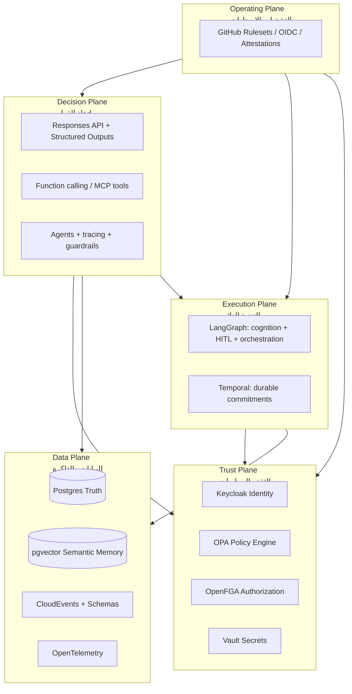
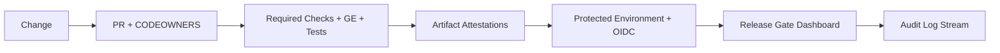
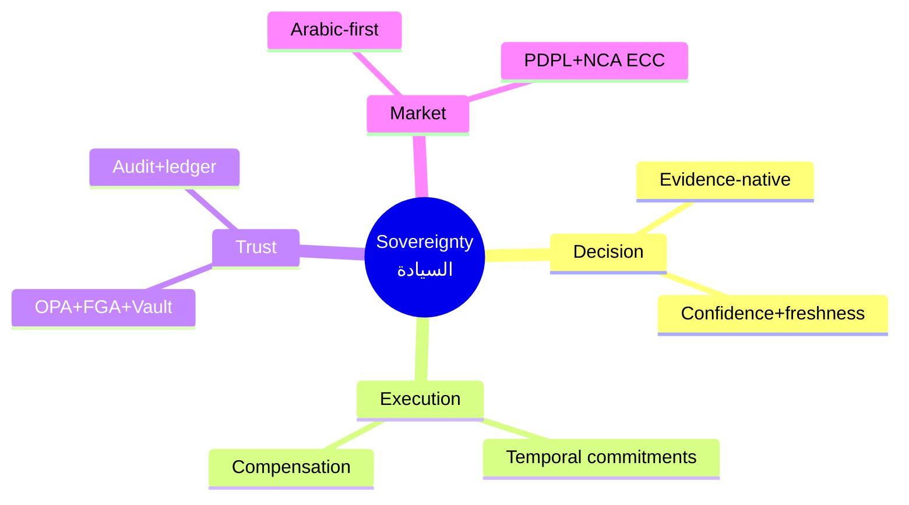
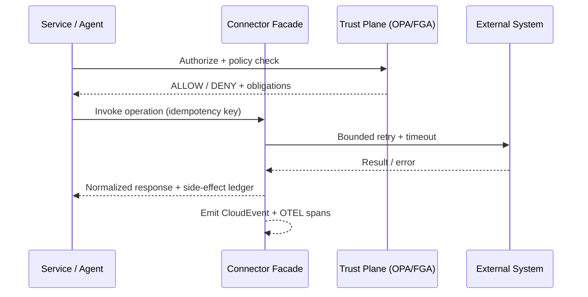
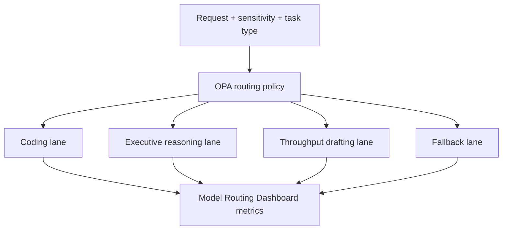
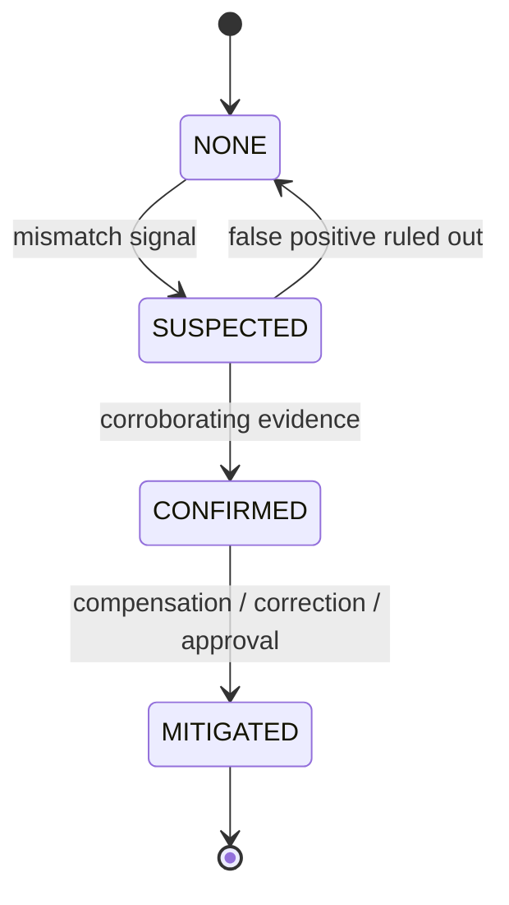

# Dealix Sovereign Enterprise Growth OS  
## نظام النمو المؤسسي السيادي — Blueprint / المخطط المعماري

**Document type:** Enterprise architecture blueprint  
**Product:** Dealix (SalesFlow SaaS ecosystem)  
**Audience:** Engineering, security, compliance, product, and executive stakeholders  
**Version:** 1.0  
**Status:** Canonical reference — program locks apply (see §8)

---

## 1. Vision | الرؤية

### 1.1 Sovereign Enterprise Growth OS — English

Dealix is **not a CRM**. It is a **Sovereign Enterprise Growth Operating System**: a unified platform that governs how revenue organizations **decide**, **execute**, **trust**, **remember**, and **operate** across the full growth lifecycle.

The platform spans:

- **Sales** (pipeline, forecasting, commitments, revenue motions)
- **Partnerships** (ecosystem, co-sell, alliances, channel governance)
- **Corporate Development / M&A** (thesis, sourcing, diligence, integration planning)
- **Expansion** (markets, segments, launches, localization)
- **PMI / PMO** (integration governance, benefits realization, program controls)
- **Governance** (policy, risk, board-ready evidence, audit-grade traceability)

**Sovereignty** means the enterprise retains **decision rights**, **execution control**, **trust boundaries**, **data residency and lineage**, and **operational independence** — while still benefiting from advanced AI and automation.

### 1.2 نظام النمو المؤسسي السيادي — العربية

Dealix منصة **سيادية** لإدارة النمو المؤسسي: تجمع بين **المبيعات** و**الشراكات** و**التطوير المؤسسي/الاستحواذ** و**التوسع** و**إدارة ما بعد الدمج/المشاريع** و**الحوكمة** في طبقة تشغيل واحدة تضمن **الأدلة** و**الموافقات** و**قابلية التدقيق** و**الامتثال السعودي**.

---

## 2. Five-Planes Architecture | المعمارية ذات الخمس طبقات

Dealix separates concerns into **five planes**. Each plane has distinct SLAs, blast radius, and governance posture.

### 2.1 Decision Plane | طبقة القرار

**Purpose:** Convert noisy reality into **decisions** backed by structured reasoning, evidence, and measurable confidence.

**Capabilities:**

| Capability | Description |
|------------|-------------|
| Signal detection | Ingest structured + unstructured signals; rank by relevance, sensitivity, and business impact |
| Triage | Classify incidents, opportunities, risks, and escalations with policy-aware routing |
| Scenario analysis | Compare branches (base / upside / downside) with explicit assumptions |
| Memo generation | Board- and exec-ready narratives with citations and policy notes |
| Forecasting | Probabilistic forecasts with drivers, seasonality, and segment decomposition |
| Recommendation | Ranked options with tradeoffs, constraints, and reversibility class |
| Next best action | Operationalize recommendations into governed action candidates |
| Evidence pack assembly | Bundle sources, assumptions, freshness, model versions, and approvals metadata |

**Implementation anchors:**

- **OpenAI Responses API** with **Structured Outputs** for machine-verifiable artifacts (memos, risk registers, decision JSON).
- **Function calling / MCP** for tool execution under strict contracts (see §7).
- **Agent tracing + guardrails** for safety, policy hooks, and forensic replay.
- **LangGraph** for **stateful loops**, **human-in-the-loop (HITL) interrupts**, and medium-horizon reasoning graphs.

**Non-goals:** The Decision Plane must not silently create irreversible external commitments without passing through Trust + Execution controls.

### 2.2 Execution Plane | طبقة التنفيذ

**Purpose:** Run processes that span **minutes to days**, cross systems, require **retry / timeout / compensation**, create **external commitments**, or must **pause for approval** and **resume** safely.

**Partitioning rule:**

- **LangGraph** = cognition + HITL + **short/medium** orchestration (interactive workflows, agent loops, approvals, document-driven steps).
- **Temporal** = **durable business commitments** (invoices, contracts workflow, provisioning, partner onboarding, PMI workstreams) with deterministic replay and sagas.

**Patterns:** idempotency keys, explicit timeouts, compensation workflows, outbox/event emission, and correlation IDs propagated to OpenTelemetry.

### 2.3 Trust Plane | طبقة الثقة

**Purpose:** Enforce **who can do what**, **under which policy**, **with which evidence**, and **with what audit trail**.

**Components:**

| Component | Role |
|-----------|------|
| **Keycloak** | Identity, SSO, federation, session hardening |
| **OPA** | Policy-as-code for decisions, tool allowlists, data access, routing rules |
| **OpenFGA** | Fine-grained authorization (tenant / org / deal / document / field-level where required) |
| **HashiCorp Vault** | Secrets governance, dynamic credentials, encryption workflows |
| **Tool verification ledger** | Cryptographically or procedurally verifiable record of intended vs actual tool usage |
| **Evidence packs** | Standardized evidentiary objects for approvals and audits |
| **Contradiction detection** | Cross-check claims vs side effects (see §11) |
| **AI governance** | Model routing policy, safety classes, logging, retention, and human oversight hooks |

### 2.4 Data Plane | طبقة البيانات

**Purpose:** Establish **operational truth**, **semantic memory**, **contract-grade events**, and **observable quality**.

| Layer | Technology | Responsibility |
|-------|-------------|------------------|
| Operational truth | **Postgres** | Transactions, entities, workflows state (where not Temporal-native), entitlements references |
| Semantic memory | **pgvector** | Embeddings, retrieval, similarity governance tied to authorization |
| Ingestion | **Airbyte** | Connectors to CRM, ERP, ticketing, comms platforms — governed sync contracts |
| Document extraction | **Unstructured** | Normalize PDFs, decks, datasheets into text/tables with provenance |
| Semantic metrics | Metrics layer | KPI definitions that bind to lineage: definition, owner, refresh SLA |
| Data quality | **Great Expectations** | Suites tied to pipelines and release gates |
| Contracts | **CloudEvents** + **JSON Schema** + **AsyncAPI** | Event and API contracts for internal and partner integrations |
| Observability | **OpenTelemetry** | Traces, metrics, logs — correlated to approvals and tool calls |

### 2.5 Operating Plane | طبقة التشغيل

**Purpose:** Ensure **software delivery** itself is sovereign: reproducible, reviewed, attested, and aligned to enterprise controls.

**Controls:**

- GitHub **rulesets**, **protected branches**, **CODEOWNERS**
- **Required status checks** and merge queues
- **Environments** + **deployment protection rules**
- **OIDC federation** to cloud roles (no long-lived CI secrets by default)
- **Artifact attestations** (build provenance)
- **External audit log streaming** to SIEM / enterprise observability

---

## 3. Six Business Tracks | المسارات الستة للأعمال

Each track is a **product module family** sharing the same five planes, connector facade (§7), evidence model (§10), and program locks (§8).

### 3.1 Revenue OS | نظام الإيرادات

**Objective:** Predictable revenue engine with governed motion design and forensic forecast lineage.

**Features (representative, non-exhaustive):**

- Account & territory model with sensitivity-aware fields
- Pipeline hygiene scoring + explainable drivers
- Forecast rooms with scenario branches and consensus workflow
- Commit management with **reversibility class** and approval class
- Playbooks tied to evidence packs (battlecards, ROI worksheets)
- Revenue funnel control center (coverage, conversion, velocity, leakage)
- Pricing / packaging governance hooks (policy + approval)
- Quoting integration facade (idempotent operations, compensation on failure)
- Win/loss intelligence with contradiction checks vs CRM actuals
- Executive summaries with freshness + confidence trio (§8.9)

### 3.2 Partnership OS | نظام الشراكات

**Objective:** Ecosystem growth with transparent obligations, scorecards, and co-sell governance.

**Features:**

- Partner lifecycle (recruit → onboard → enable → co-sell → renew)
- Alliance workspace: joint value proposition, joint pipeline, MDF governance
- Partner scorecards: revenue, influence, support load, compliance posture
- Tiering model with policy-driven benefits
- Partner data sharing contracts (schema/versioned events)
- Conflict resolution when partner claims disagree with internal systems
- Co-sell motion templates with HITL gates for external commitments

### 3.3 M&A / CorpDev OS | نظام التطوير المؤسسي والاستحواذ

**Objective:** Institutionalize thesis, pipeline, diligence, and risk with board-grade evidence.

**Features:**

- Thesis library + strategic fit scoring + guardrails on sensitive data
- Target longlist / shortlist with sourcing signals
- **DD Room**: VDR-lite workflows, Q&A logs, issue lists, red-flag tracking
- Financial model versioning with explicit assumptions ledger
- Risk register linked to policy violations and compensating controls
- Integration hypothesis (Day-1 / 100-day) linked to PMI engine
- Deal pacing, gates, and approval routing aligned to Trust Plane

### 3.4 Expansion OS | نظام التوسع

**Objective:** Launch new markets/segments with operational rigor and localized compliance.

**Features:**

- Market entry checklist templates (regulatory, data residency, payments)
- Localization workspace (Arabic-first UX requirements, content governance)
- Launch console: milestones, owners, dependencies, rollback plans
- Competitive intelligence ingestion with provenance
- Expansion KPIs tied to semantic metrics definitions
- Partner/channel dependency mapping

### 3.5 PMI / PMO OS | نظام ما بعد الدمج وإدارة المشاريع

**Objective:** Deliver synergies with program discipline, benefits tracking, and controlled change.

**Features:**

- **PMI 30/60/90 engine** with standardized deliverables and approvals
- IMO / workstream charters, RAID logs, dependency graphs
- Synergy tracking: forecast vs realized, financial model tie-out
- Policy-controlled change management integration (ITSM facade)
- Benefits realization baselines and measurement cadence
- Cross-system migration runbooks with Temporal sagas where appropriate

### 3.6 Executive / Board OS | نظام الإدارة التنفيذية ومجلس الإدارة

**Objective:** Single executive surface for decisions, risk, and performance with evidence-native artifacts.

**Features:**

- Executive room: narrative + metrics + risks in one place
- Board pack automation with citations and “known unknowns”
- Strategy-to-execution alignment maps (OKRs / initiatives / commitments)
- Risk appetite statements operationalized into OPA policies
- Model routing transparency for AI-assisted sections (which lane, why)

---

## 4. Automation Classification | تصنيف الأتمتة

Dealix classifies work into **automation tiers**. Classification drives UI, policy defaults, and audit behavior.

### 4.1 Fully automated | أتمتة كاملة (machine may proceed)

**Criteria:** Reversible or low-blast-radius, no external legal/financial commitment, policy green, sensitivity low/medium per model.

**Examples:**

- Internal summarization of non-sensitive documents with retrieval scoped by OpenFGA
- Drafting emails/memos marked as **draft** with no outbound send
- Generating scenario analyses that do not mutate authoritative records
- Connector health checks and schema drift detection (read-only)
- Semantic search ranking and internal recommendations without side effects

### 4.2 Mandatory approval (HITL) | موافقة إلزامية

**Criteria:** Any of: external commitment, irreversible / hard-to-reverse operation, high sensitivity, regulatory exposure, financial posting, partner-visible action, privileged access, bulk export, model routing override.

**Examples:**

- Sending partner/customer communications from governed channels
- Updating authoritative forecast commits in CRM/ERP
- Contract clause changes, signature routing, or legal hold interactions
- Payments, invoicing, provisioning, role elevation, secret issuance
- Publishing board/executive materials externally
- Overriding policy routing (e.g., forcing a non-default model lane)

**Implementation:** LangGraph interrupts + Temporal signals; OpenFGA + OPA must align on **approval class** (§8.6).

---

## 5. Sovereignty Dimensions | أبعاد السيادة

| Dimension | Definition | Dealix enforcement |
|-----------|------------|---------------------|
| **Decision sovereignty** | The enterprise chooses outcomes; AI proposes | Policy-bound recommendations; explicit human decision records; evidence packs |
| **Execution sovereignty** | Side effects happen only under enterprise control | Temporal durability; compensations; connector facade; approval classes |
| **Trust sovereignty** | Identity, authorization, and policy are enterprise-governed | Keycloak + OpenFGA + OPA + Vault + audit streams |
| **Market sovereignty** | Local language, norms, compliance, and data residency are first-class | Arabic-first UX; PDPL/NCA alignment; contracting for KSA market realities |

---

## 6. Arabic-First & Saudi Compliance | العربية أولاً والامتثال السعودي

### 6.1 Arabic-first product principles

- **RTL-first** layouts for executive and operational surfaces where Arabic is primary.
- **Bilingual artifacts**: Arabic narrative for internal/exec use with optional English pair for multinational boards — always with the same evidence pack identifiers.
- **Named entity handling** for Arabic org/person names in search, dedupe, and graph-like references.
- **Locale-aware numerals and currency**: SAR, business week Sun–Thu in defaults.

### 6.2 Regulatory & standards mapping (high level)

| Requirement area | Primary anchor | Dealix architectural response |
|------------------|----------------|------------------------------|
| Personal data protection | **PDPL (Saudi Arabia)** | Data minimization, purpose limitation, DSAR workflows, retention policies, residency options, DPIA templates, vendor DPAs for connectors |
| Cybersecurity controls | **NCA ECC 2-2024** (reference framework) | Hardened identity, secrets in Vault, encryption in transit/at rest, logging/monitoring, incident response hooks, privileged access governance |
| AI risk management | **NIST AI RMF** | Govern, map, measure, manage — mapped to Trust Plane + evidence + human oversight |
| LLM-specific threats | **OWASP LLM Top 10** | Tool verification ledger, prompt injection defenses, least privilege tool scopes, output handling, sensitive data controls, unsafe dependency governance |

**OWASP LLM Top 10 → control mapping (illustrative):**

| Risk | Control plane hooks |
|------|---------------------|
| Prompt injection | OPA tool policies, input sanitation, retrieval boundaries |
| Insecure output handling | Schema validation, publishing gates, sandboxed previews |
| Training data poisoning | Supply chain controls on corpora + signed ingestion pipelines |
| Model denial of service | Routing quotas, cost controls, backpressure |
| Supply chain vulnerabilities | Operating plane attestations, dependency scanning |
| Sensitive information disclosure | OpenFGA field-level access, DLP integrations, redaction patterns |
| Insecure plugin design | MCP/function contracts + verification ledger |
| Excessive agency | HITL classes, reversibility classes, Temporal compensation |
| Overreliance | Confidence/freshness trio, contradiction engine |
| Model theft | Vault-managed keys, access auditing, deployment protections |

---

## 7. Connector Facade Pattern | نمط واجهة الموصلات

All external systems integrate through a **Connector Facade** — never ad-hoc SDK calls scattered across services.

### 7.1 Required contract fields

| Field | Requirement |
|-------|-------------|
| **Contract** | AsyncAPI/JSON Schema for operations; CloudEvents for emissions |
| **Version** | Semantic versioning; breaking vs non-breaking change policy |
| **Retry policy** | Bounded retries with jitter; idempotent replay semantics |
| **Timeout policy** | Per-operation budgets; partial progress handling |
| **Idempotency key** | Stable keys for mutating calls; dedupe store |
| **Approval policy** | Which approval class can authorize which operations |
| **Audit mapping** | Canonical audit event types; actor, tenant, subject, payload hashes |
| **Telemetry mapping** | OTEL span names, attributes, correlation to Temporal workflow IDs |
| **Rollback / compensation notes** | Explicit saga steps or manual runbook links |

---

## 8. Program Locks | أقفال البرنامج (غير قابلة للتجاوز دون قرار معماري)

These locks prevent accidental re-architecture or “shadow governance.”

### 8.1 Five planes

Decision, Execution, Trust, Data, Operating — **no merging** Trust into Decision or Data into Execution without an explicit architecture decision record (ADR) and compliance review.

### 8.2 Six business tracks

Revenue, Partnership, M&A/CorpDev, Expansion, PMI/PMO, Executive/Board — features ship **inside a track** or as **horizontal platform** capabilities consumed by tracks — not as siloed one-offs bypassing evidence and policy.

### 8.3 Three agent roles (example canonical set — tunable by policy)

| Role | Mission |
|------|---------|
| **Analyst Agent** | Signal → structured artifacts (risk/issue lists, DD questions, metrics anomalies) |
| **Operator Agent** | Proposes actions, prepares packs, never exceeds delegated tool scopes |
| **Executive Copilot** | Synthesis, scenario framing, board narrative — always evidence-cited |

### 8.4 Three action classes

| Class | Description |
|-------|-------------|
| **Read** | Retrieve, summarize, search |
| **Propose** | Create drafts / plans / diffs without committing |
| **Commit** | Mutate external/authoritative state — requires Execution + Trust alignment |

### 8.5 Three+ approval classes (minimum)

1. **Manager approval** — routine externalizations with reversibility ≤ class B  
2. **Functional executive approval** — financial / partner / legal sensitivity  
3. **Board / committee approval** — M&A milestones, regulatory disclosures, enterprise risk acceptance  
4. *(Optional fourth)* **Emergency break-glass** — time-bounded, fully audited, post-incident review mandatory  

### 8.6 Four reversibility classes

| Class | Definition | Automation posture |
|-------|------------|--------------------|
| **A — Trivially reversible** | Undo within minutes, no external notice | May be automated with policy |
| **B — Reversible with cost** | Rollforward/rollback scripts, customer/partner comms may be needed | HITL common |
| **C — Hard to reverse** | Contractual, reputational, or financial stickiness | HITL mandatory |
| **D — Irreversible** | Legal filings, published statements, non-repudiable commitments | HITL + multi-party approval |

### 8.7 Sensitivity model

**Public / internal / confidential / restricted / regulated** — binds to OpenFGA, DLP, model routing lanes, retention, and masking in UI.

### 8.8 Provenance / freshness / confidence trio

Every externally meaningful artifact carries:

- **Provenance**: sources, connectors, document versions, extraction timestamps  
- **Freshness**: SLA + actual age + next refresh plan  
- **Confidence**: model + retrieval + data-quality signals, expressed conservatively for exec consumption  

---

## 9. Sovereign Routing Fabric | شبكة التوجيه السيادية للنماذج

**Goal:** Route workloads to **the right model and tool budget** under **policy**, **cost**, **latency**, and **risk** constraints — with measurable outcomes.

### 9.1 Policy-based lanes

| Lane | Typical use | Quality/latency posture |
|------|-------------|-------------------------|
| **Coding lane** | codegen, SQL, internal DSL, structured transforms | Strong compiler/test feedback loops |
| **Executive reasoning lane** | memos, board narratives, scenario planning | Higher reasoning depth; stricter citations |
| **Throughput drafting lane** | high-volume drafts, internal ops notes | Cost-optimized; more guardrails on externalization |
| **Fallback lane** | outage/degradation; local or alternate provider per policy | Deterministic degraded templates + HITL |

### 9.2 Metrics (minimum)

- Lane utilization, refusal rate, policy violation counts  
- Cost per successful artifact, tail latency  
- Human edit distance / acceptance rate (where measurable)  
- Tool-call error rate and compensation frequency  
- Contradiction engine incidence rate and time-to-resolution  

---

## 10. Evidence-Native Operations | العمليات المبنية على الأدلة

Dealix treats **evidence** as a first-class object — not an afterthought PDF.

### 10.1 Evidence pack fields (canonical)

| Element | Purpose |
|---------|---------|
| **Sources** | URLs, doc IDs, connector lineage, extraction hashes |
| **Assumptions** | Explicit, testable statements with owners |
| **Freshness** | Age, refresh cadence, stale warnings |
| **Financial model version** | Tie-out to model files / sheets / parameters |
| **Policy notes** | OPA decisions, OpenFGA constraints, applicable regulations |
| **Alternatives** | Option set with tradeoffs |
| **Rollback / compensation** | What to do if wrong; who approves execution |
| **Approval class** | Who must sign |
| **Reversibility class** | Blast radius language for approvers |

---

## 11. Contradiction Engine | محرك التناقضات

**Purpose:** Detect when **claims** diverge from **reality** or when **tool effects** diverge from **intent**.

### 11.1 Core inputs

| Field | Description |
|-------|-------------|
| **Intended action** | Human/agent-declared plan step |
| **Claimed action** | Natural language or UI assertion of what happened |
| **Actual tool call** | Normalized MCP/function ledger entry (parameters redacted per sensitivity) |
| **Side effects** | Downstream events, connector mutations, CloudEvents receipts |
| **Contradiction status** | `NONE` / `SUSPECTED` / `CONFIRMED` / `MITIGATED` |

**Outputs:** tickets to Policy Violations Board, Risk Board linkage, connector health signals, and executive room “exceptions.”

---

## 12. Eighteen Required Surfaces | الثماني عشرة واجهة مطلوبة

Each surface is **non-optional** for enterprise readiness; implementation may be phased, but **capability gaps** must be tracked as program risk.

| # | Surface | Purpose |
|---|---------|---------|
| 1 | **Executive Room** | Decision-centric exec overview |
| 2 | **Approval Center** | HITL queues, SLAs, delegation, evidence preview |
| 3 | **Evidence Pack Viewer** | Source-linked, tamper-evident presentation |
| 4 | **Partner Room** | Alliance/co-sell workspace |
| 5 | **DD Room** | Diligence workflows and issues |
| 6 | **Risk Board** | Top risks, trends, mitigations, ownership |
| 7 | **Policy Violations Board** | OPA/OpenFGA violations, exceptions, break-glass |
| 8 | **Actual vs Forecast Dashboard** | Forecast quality and bias analysis |
| 9 | **Revenue Funnel Control Center** | Pipeline mechanics and leakage |
| 10 | **Partnership Scorecards** | Ecosystem performance |
| 11 | **M&A Pipeline Board** | Deal flow and gates |
| 12 | **Expansion Launch Console** | Market entry milestones |
| 13 | **PMI 30/60/90 Engine** | Integration cadence management |
| 14 | **Tool Verification Ledger** | Forensic tool-use trace |
| 15 | **Connector Health Board** | Facade SLOs, schema drift, retries |
| 16 | **Release Gate Dashboard** | Shipping controls vs policy |
| 17 | **Saudi Compliance Matrix** | PDPL/NCA/NIST/OWASP control status |
| 18 | **Model Routing Dashboard** | Lane metrics, overrides, costs |

---

## 13. Enterprise Readiness Criteria | معايير الجاهزية المؤسسية

The platform is **enterprise-ready** when **all eight** conditions are true:

1. **Identity & authorization are production-grade** — Keycloak + OpenFGA + OPA in path for mutating actions and sensitive reads.  
2. **Durable execution exists for commitments** — Temporal patterns for external side effects; LangGraph for cognition/HITL; documented compensation.  
3. **Evidence packs are mandatory for externalized exec/partner artifacts** — with provenance, freshness, and confidence.  
4. **Observability is end-to-end** — OpenTelemetry from UI → services → agents → connectors → workflows, correlated to approvals.  
5. **Data contracts are enforced** — CloudEvents + JSON Schema + AsyncAPI governed in CI; incompatible changes require versioning discipline.  
6. **Data quality gates exist** — Great Expectations (or equivalent) blocking releases on critical datasets.  
7. **Operating plane controls are enforced** — rulesets, required checks, protected environments, OIDC, attestations, audit streaming.  
8. **Contradiction engine is operational** — tool ledger + side-effect correlation producing actionable statuses, not passive logs.

---

## Appendix A. Reference stack alignment (non-binding vendors)

Components named (OpenAI Responses, LangGraph, Temporal, OPA, OpenFGA, Vault, Keycloak, Airbyte, Unstructured, Great Expectations, CloudEvents, AsyncAPI, OpenTelemetry, GitHub advanced controls) are **architectural intent**. Selection may vary by deployment, but **substitutions must preserve plane boundaries and program locks**.

---

## Appendix B. Glossary | مصطلحات

| Term | Meaning |
|------|---------|
| **HITL** | Human-in-the-loop |
| **PMI** | Post-merger integration |
| **OPA** | Open Policy Agent |
| **PDPL** | Saudi Personal Data Protection Law |
| **ECC** | Essential Cybersecurity Controls (NCA Saudi Arabia) |

---

**End of document — Dealix Sovereign Enterprise Growth OS Blueprint**
