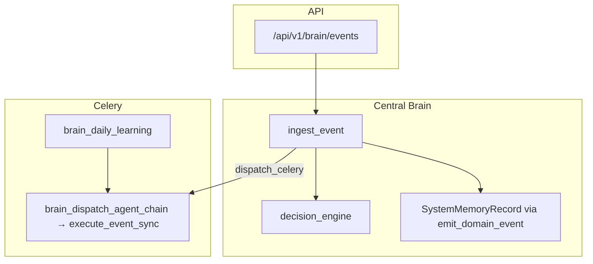

# Dealix Central Brain OS — Implementation Map

Production integration layer: **no changes** to existing `/leads`, `/deals`, `/auth` contracts. New surface: **`/api/v1/brain/*`**.

## Architecture

## Key files

| Component | Path |
|-----------|------|
| Brain service | `app/brain/service.py` |
| Agent profiles (8 agents) | `app/brain/profiles.py` |
| Skill registry | `app/brain/skills/registry.py` |
| Decision / routing | `app/brain/decision_engine.py` |
| Safety (rate limit) | `app/brain/safety.py` |
| Metrics (process) | `app/brain/observability.py` |
| Learning + self-improve bridge | `app/brain/learning_loop.py` |
| Runtime DB | `app/models/brain_runtime.py` |
| Unified memory (existing) | `app/models/second_brain.py` |
| REST | `app/api/v1/brain.py` |
| Celery | `app/workers/brain_tasks.py` |

## REST (JWT required except health)

| Method | Path | Purpose |
|--------|------|---------|
| GET | `/api/v1/brain/health` | Brain + framework snapshot (exempt from internal token) |
| GET | `/api/v1/brain/metrics` | Counters |
| GET | `/api/v1/brain/agents` | Registered agent profiles |
| GET | `/api/v1/brain/skills` | Skill definitions |
| GET | `/api/v1/brain/profiles/{key}` | One profile |
| POST | `/api/v1/brain/events` | Ingest event → `DomainEvent` + scores + rules + optional Celery dispatch |
| GET | `/api/v1/brain/sessions` | Recent `BrainAgentSession` rows |

## Event flow

1. `POST /brain/events` → `ingest_event` → `emit_domain_event` (existing) → mirror to `system_memory_records`.
2. Heuristic `DecisionScores` + DB `reasoning_rules` (if seeded per tenant).
3. `suggested_agents` from event type + scores.
4. Optional `dispatch_celery: true` → `brain_dispatch_agent_chain` → existing `execute_event_sync` (AgentExecutor).

## Celery beat

- `brain_daily_learning` — 05:00 `Asia/Riyadh` (`celery_app.py`): per-tenant `LearningMetricSnapshot` + `SelfImprovementSuggestion` + one `self_improvement_flow` run.

## Memory tiers

`memory_tier` on ingest: `short_term` | `long_term` | `agent` | `system` | `user`.  
`user` + JWT writes an extra `SystemMemoryRecord` with `_user_id` in payload.

## Next wiring (incremental)

1. Replace `execute_skill` noop handlers with real calls (`email_service`, WhatsApp, etc.).
2. Seed `reasoning_rules` per tenant via admin or migration.
3. Persist `BrainAgentSession` inside `brain_dispatch_agent_chain` when full observability is required.

See also: `docs/SYSTEM_INTELLIGENCE_LAYER.md`.
