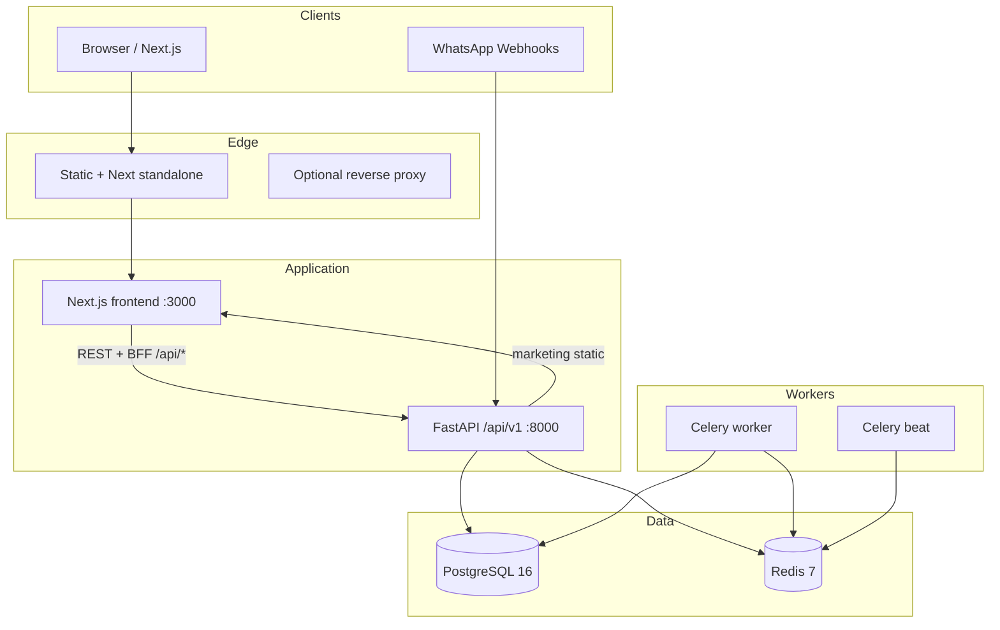

# Dealix — Enterprise Upgrade & Hardening Master (Existing System)

**Scope:** Continue `salesflow-saas` (FastAPI + Next.js + PostgreSQL + Redis + Celery). No greenfield.  
**Repo anchors:** `docker-compose.yml`, `backend/app`, `frontend/src`, `middleware.ts`, `GET /api/v1/agent-frameworks`.

---

## PHASE 1 — System Architecture (Current + Target)

### Current production topology (as implemented)

### Service boundaries (keep)

| Boundary | Owns | Must not own |
|----------|------|--------------|
| `frontend/` | UI, BFF routes (`/api/strategy-summary`, `/api/marketing-hub`), `middleware.ts` session gate | Business rules, DB |
| `backend/app/api/v1` | REST, auth, webhooks | Long sync LLM chains |
| `backend/app/workers` | Async jobs, retries | HTTP request lifecycle |
| `backend/app/services` | Domain logic | Raw SQL in routers |

### Environments

| Env | Purpose | Infra |
|-----|---------|-------|
| **dev** | Local `docker-compose`, hot reload | Single-node PG/Redis |
| **staging** | Parity with prod, lower TTL | Separate DB + Redis URLs; `DEALIX_DEMO_MODE=true` optional |
| **prod** | Customer traffic | Managed PG, Redis cluster or Elasticache, secrets vault |

### Scaling (incremental; no rewrite)

| Layer | Now | Next step |
|-------|-----|-----------|
| API | Single uvicorn | 2+ replicas behind LB; sticky sessions only if needed for WS later |
| Workers | `-c 4` | Separate queues: `high_priority`, `default`, `low`; scale workers per queue |
| DB | Single primary | Read replicas for analytics routes only when p95 > 200ms |
| Redis | Single | Sentinel/Elasticache when failover required |
| Frontend | Next standalone | CDN for `public/`; same-origin BFF |

### Load balancing

- **HTTP:** round-robin or least-conn to FastAPI replicas; health: `GET /api/v1/health` + `GET /api/v1/ready`.
- **Queues:** Celery task routing by name (`app.workers.*` already split files).

---

## PHASE 2 — UX & Product Structure

### Site map (current routes — extend, don’t replace)

| Area | Routes (examples) | Notes |
|------|---------------------|-------|
| Public | `/`, `/landing`, `/strategy`, `/help`, `/resources`, `/explore` | Marketing + preview |
| Auth | `/login`, `/register`, `/partner-gate` | `next` query preserved |
| App shell | `/dashboard`, `/dashboard/*` | `DealixDashboardShell` tabs |
| Marketers | `/marketers`, `/marketers/team`, `/marketers/deals`, `/marketers/account` | Partner gate optional |
| Static marketing | `/dealix-marketing/*`, `/dealix-presentations/*` | Synced to `public/` |

**Gap vs enterprise IA:** Add **explicit** top-level nav entries in product (not marketing) for: **Leads**, **Deals**, **Messages**, **Reports**, **Settings**, **Billing**, **Integrations** — map each to existing tab or new thin route that wraps current view.

### Core flow A — Lead → Deal

| Step | User | System | API | Errors | Recovery |
|------|------|--------|-----|--------|----------|
| 1 | Creates/registers tenant | JWT issued | `POST /api/v1/auth/register` | 400 validation | Show `parseApiErrorDetail` (frontend) |
| 2 | Creates lead | Persist | `POST /api/v1/leads` (if exposed) / internal | 401 | Refresh token flow `api-client.ts` |
| 3 | Moves pipeline | Stage update | `PATCH /api/v1/deals/{id}` | 409 conflict | Retry + toast |
| 4 | Dashboard KPI | Aggregate | `GET /api/v1/dashboard/overview` | 503 | Cached empty state |

### Core flow B — Client onboarding

| Step | User | System | API | Errors | Recovery |
|------|------|--------|-----|--------|----------|
| 1 | Reads journey | Static + API | `GET /api/v1/customer-onboarding/journey` | offline | Cached copy in UI |
| 2 | Completes profile | Tenant data | companies/users endpoints | 422 | Field-level errors |

### Core flow C — Daily operations

| Step | User | System | API | Errors | Recovery |
|------|------|--------|-----|--------|----------|
| 1 | Opens dashboard | Real metrics | `dashboard/overview` + `pipeline` | network | Arabic message in `api-client.ts` |
| 2 | Messaging | Celery | workers `message_tasks` | DLQ (add) | Requeue policy |

---

## PHASE 3 — Component Inventory

**Fact:** UI is **feature-view heavy** (`dealix/*-view.tsx`), not a 30-component atomic library yet.

### Current (mapped to target primitives)

| # | Conceptual component | Current implementation | File(s) to consolidate |
|---|---------------------|-------------------------|------------------------|
| 1 | Button | Native `<button>` + Tailwind | All views |
| 2 | Input | `<input>` / forms | `login`, `register`, marketer forms |
| 3 | Card | `glass-card` class pattern | `dashboard-view`, `dealix-public-site` |
| 4 | Modal / Dialog | Radix not installed; custom | `dealix-assistant-widget` |
| 5 | Sidebar | `DealixDashboardShell` aside | `dealix-dashboard-shell.tsx` |
| 6 | Table | `<table>` in `dashboard-view` | same |
| 7 | Tabs | Button list switching state | `dealix-dashboard-shell.tsx` |
| 8 | Toast | Not standardized | **Add** `sonner` or Radix toast |
| 9 | Loader | `Loader2` lucide | multiple |
| 10 | Badge | `rounded-full` spans | strategy panel |
| 11 | Avatar | Initials div | shell header |
| 12 | Chart | `recharts` where used | `analytics-view`, etc. |
| 13 | Filter | Ad-hoc | lead-generator |
| 14 | Search | Input + icon | dashboard |
| 15 | Tooltip | Rare | **Add** `@radix-ui/react-tooltip` |
| 16 | Breadcrumb | Missing | **Add** for `/dashboard/*` |
| 17 | Navbar | Public site + marketers | `dealix-public-site`, marketers layouts |
| 18 | Footer | Public | `dealix-public-site` |
| 19 | Stepper | Onboarding views | `onboarding-view`, `customer-onboarding-journey-view` |
| 20 | Kanban | Not standard | **Future** deals board |
| 21 | Calendar | Meetings | `meetings` API + view if present |
| 22 | Pagination | Tables | when lists > 50 rows |
| 23 | Dropdown | `<select>` native | dashboard |
| 24 | Form | React forms | auth |
| 25 | Notification banner | `DeploymentReadinessBanner` | `deployment-readiness-banner.tsx` |
| 26 | Stat tile | Dashboard cards | `dashboard-view` |
| 27 | Empty state | Partial | **Standardize** copy + CTA |
| 28 | Error boundary | Next default | **Add** `error.tsx` per segment |
| 29 | Skeleton | Missing | **Add** for dashboard load |
| 30 | Divider | borders | ubiquitous |

**Standardization action:** Create `frontend/src/components/ui/` with **wrappers** (Button, Card, Input) mapping to existing Tailwind tokens — **without** removing existing screens.

---

## PHASE 4 — Design System Hardening

**Source of truth:** `frontend/src/app/globals.css` + `tailwind.config.js`.

### Tokens

Canonical export: `frontend/design-tokens.dealix.json` (generated from current CSS variables).

### Typography (align with `layout.tsx`)

| Token | Usage |
|-------|--------|
| Page title | `text-2xl md:text-3xl font-bold` (dashboard) |
| Section | `text-lg font-bold` |
| Body | `text-sm md:text-base` |
| Caption | `text-xs text-muted-foreground` |

### Spacing

- Base unit **8px** — Tailwind default; enforce `gap-2|4|6|8` in new components only.

### Breakpoints

Use Tailwind defaults: `sm` 640, `md` 768, `lg` 1024, `xl` 1280.

### Accessibility (WCAG 2.2 AA)

| Rule | Action |
|------|--------|
| Focus | Add visible `focus-visible:ring-2 ring-ring` on interactive elements in new `ui/*` |
| Contrast | Primary on dark: verify `primary` vs `background` ≥ 4.5:1 for text |
| RTL | `dir="rtl"` on `<html>` — keep |
| Assistant | Ensure dialog `aria-modal`, `aria-labelledby` on widget |

---

## PHASE 5 — Performance

### Budget (targets)

| Metric | Target (prod) | Measurement |
|--------|---------------|-------------|
| TTFB (HTML) | < 200ms | Vercel / nginx logs |
| FCP | < 1.8s | Lighthouse |
| LCP | < 2.5s | Lighthouse |
| API p95 | < 300ms | APM on `/api/v1/dashboard/overview` |
| TTI | < 3.5s | Lighthouse |

### Plan (incremental)

| Item | Implementation |
|------|----------------|
| Code splitting | `next/dynamic` for heavy views (`recharts`, `three` if any route uses) |
| Images | `next/image` for any remote Unsplash; set `sizes` |
| Caching | `Cache-Control` on BFF routes already `no-store` for auth; static assets `immutable` via CDN |
| DB | Add indexes on `Lead.tenant_id`, `Deal.tenant_id`, `Message.tenant_id` (verify Alembic) |
| Pooling | SQLAlchemy `pool_size` / `max_overflow` in `database.py` for prod |

---

## PHASE 6 — SEO & Discoverability

### Current

- Root `metadata` in `layout.tsx` — single title/description.
- Many routes lack per-page `metadata`.

### Actions

| Page type | metadata export |
|-----------|-----------------|
| `/` | Already in layout — override in `page.tsx` if needed |
| `/strategy`, `/help`, `/marketers` | Add `export const metadata` in each `page.tsx` |
| Marketing HTML | `robots` via CDN — `public/robots.txt` **add** if missing |

### Schema

- `Organization` + `WebSite` JSON-LD on homepage only (single script).

### Sitemap

- `app/sitemap.ts` (Next) listing public routes — **add**.

---

## PHASE 7 — Conversion

### Improvements (Dealix-specific)

| Lever | Change |
|-------|--------|
| CTA | Single primary: `/register?next=/dashboard` above fold on `/` |
| Trust | `DeploymentReadinessBanner` only for logged-in — keep; add SOC2-ready copy in footer once true |
| Pricing | No public pricing page — **add** `/pricing` when offer is fixed |
| Onboarding | Reduce marketer steps — `marketer-os-panel` already localStorage; add server sync |

### A/B tests (10)

1. Hero CTA: "إنشاء حساب" vs "جولة بدون تسجيل"
2. `/explore` default tab: overview vs leads
3. Register: phone field prominence
4. Strategy page: long-form vs collapsible sections
5. Marketers: video script link vs arsenal first
6. Assistant default prompt chips
7. Dashboard stat order: leads first vs revenue first
8. Login: magic link vs password (if product adds)
9. Partner gate copy length
10. Resources: ZIP vs index-first

---

## PHASE 8 — Backend & API

### Already present

- JWT auth, refresh, `InternalApiTokenMiddleware`, `SecurityHeadersMiddleware`
- `GET /api/v1/agent-frameworks`, deployment readiness

### Hardening checklist

| Item | Standard |
|------|----------|
| Naming | Plural resources `/leads`, `/deals` — keep REST |
| Auth | `Authorization: Bearer` — done |
| Rate limit | `RATE_LIMIT_PER_MINUTE` in config — **enforce** middleware (verify `main.py`) |
| Validation | Pydantic v2 on all bodies |
| Errors | Structured `detail` — extend `HTTPException` handlers globally |
| Timeouts | `httpx` timeout on outbound integrations |
| Retries | `tenacity` on critical external calls |

### Database

- Foreign keys tenant-scoped; indexes on `(tenant_id, created_at)` for hot tables.

---

## PHASE 9 — Real-time

| Channel | Status | Design |
|---------|--------|--------|
| WhatsApp | Webhooks in `app/api/v1/webhooks` | Verify signature; idempotent processing |
| Live dashboard | Poll / SWR not yet global | **Phase 2:** SSE endpoint `/api/v1/dashboard/stream` optional |
| Notifications | Celery + email | Add WebSocket only if inbox product scope |

**Fallback:** polling 30–60s for dashboard when WS absent.

---

## PHASE 10 — Security

| Control | Status |
|---------|--------|
| HTTPS | Enforce at LB |
| JWT | Short access + refresh — implemented |
| `DEALIX_INTERNAL_API_TOKEN` | Optional prod gate |
| CSRF | SameSite cookies for future httpOnly migration |
| Secrets | No secrets in repo — `.env.phase2.example` |
| Audit | `models/audit_log.py` — wire writes on sensitive actions |
| Backup | PG daily snapshot — ops runbook |

---

## PHASE 11 — Scalability Thresholds

| Users (MAU) | API | Workers | DB |
|-------------|-----|---------|-----|
| ~1k | 2 replicas | 2 workers | Single PG |
| ~10k | 4–8 replicas | Queue split 3 | PG + read replica for analytics |
| ~100k | K8s HPA on CPU+p95 | Autoscale workers | PG cluster / Citus later |
| ~1m | Regional edge + shard tenants | Dedicated broker | Dedicated strategy per tenant tier |

---

## PHASE 12 — Observability

| Signal | Tool |
|--------|------|
| Logs | `structlog` JSON → CloudWatch/Datadog |
| Metrics | Prometheus `/metrics` **add** FastAPI exporter |
| Traces | OpenTelemetry → collector |
| Alerts | p95 API, 5xx rate, queue depth |

Health: already `/health`, `/ready`, `/agent-frameworks`, `/deployment-readiness`.

**Auto-recovery:** Celery `acks_late` + task time limits; worker restart on OOM (K8s).

---

## PHASE 13 — Revenue

| Lever | Implementation |
|-------|------------------|
| Tiers | Stripe products — `stripe_service.py` exists |
| Upsell | Feature flags per tenant |
| Retention | Dunning emails — extend `email_service` |
| Affiliates | `affiliates` API + marketer flows — align commission reporting |
| Churn | Exit survey webhook |

---

## PHASE 14 — Production QA Checklist

- [ ] `pytest` + `-m launch` green
- [ ] `npm run verify` + Playwright green
- [ ] `GET /api/v1/deployment-readiness` score acceptable
- [ ] No default `SECRET_KEY` / DB password in prod
- [ ] `robots.txt` + `sitemap.xml`
- [ ] Lighthouse mobile ≥ 85 performance (target)
- [ ] RTL + keyboard nav smoke on `/login`, `/dashboard`
- [ ] Error pages `not-found`, `error.tsx` branded
- [ ] Analytics events: register, login, dashboard_view (instrument)

---

**Owner:** Engineering + Product. **Revision:** tie to git tag via `DEALIX_GIT_SHA` in `/api/v1/health`.
