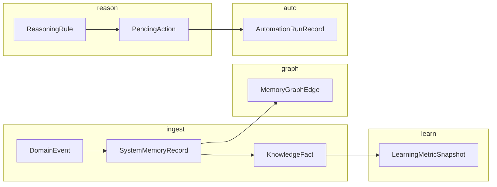

# Dealix — System Intelligence Layer (“Second Brain”)

**Status:** Additive production layer on existing CRM (Leads, Deals, Messages, Users, Reports, `DomainEvent`, `AuditLog`, `AIConversation`).  
**Central Brain OS:** [`BRAIN_OS.md`](BRAIN_OS.md) — `app/brain/`, `/api/v1/brain/*`, Celery `brain_tasks`.  
**Code:** `app/models/second_brain.py`, `app/services/system_memory_ingest.py`, wired in `emit_domain_event` → `SystemMemoryRecord`.  
**Self-improvement loop (existing):** `app/flows/self_improvement_flow.py` + `app.ai.evolution.signals` — extend with `SelfImprovementSuggestion` rows.

---

## PHASE 1 — Unified system memory

### Source → storage map

| Source | Existing table / stream | Canonical `source` | `canonical_type` examples |
|--------|-------------------------|---------------------|---------------------------|
| Domain events | `domain_events` | `event` | `whatsapp.outbound.deferred_for_approval` |
| Audit | `audit_logs` | `log` | `audit.update.Lead` |
| API | middleware / access log | `api` | `api.request.429` |
| User actions | frontend events (POST) | `user_action` | `ui.dashboard.tab_change` |
| Messages | `messages`, WA payloads | `message` | `message.inbound.whatsapp` |
| Errors | 5xx + Celery failures | `error` | `worker.task_failed` |
| Payments | Stripe webhooks | `payment` | `payment.invoice_paid` |
| Tasks | Celery task lifecycle | `task` | `task.completed` |
| Reports | dashboard/analytics snapshots | `report` | `report.pipeline_weekly` |
| Documents | `knowledge_articles`, uploads | `document` | `document.indexed` |

### Tables (implemented)

- `system_memory_records` — one row per ingested fact (`SystemMemoryRecord`).
- Ingestion: `mirror_domain_event_to_memory()` runs on every `emit_domain_event()` (`operations_hub.py`).

### Event schema (application envelope)

Existing row shape = `DomainEvent` + mirror payload. JSON Schema: `docs/intelligence/schemas/system-memory-record.schema.json` (memory row) + internal event payload = `payload` field on `DomainEvent`.

### Log schema

JSON Schema: `docs/intelligence/schemas/log-record.schema.json`.  
**Ingestion path (next):** log shipper → Celery `ingest_structured_log` → `SystemMemoryRecord` with `source=log`.

### Conversation schema

`AIConversation.messages` (JSONB) → normalized slice: `docs/intelligence/schemas/conversation-memory.schema.json`.  
**Ingestion path (next):** on conversation close, write `SystemMemoryRecord` + `KnowledgeFact` summary.

---

## PHASE 2 — Knowledge engine

### Per `SystemMemoryRecord` output row (`KnowledgeFact`)

| Field | Rule |
|-------|------|
| `summary` | LLM or template: 1–3 sentences AR/EN |
| `category` | Classifier: Sales \| Operations \| Billing \| Support \| Product \| Risk |
| `tags` | From `canonical_type` segments + entity types |
| `importance` | 1–5 from SLA impact (payment/error=5, routine UI=2) |
| `related_entities` | Resolve `lead_id`, `deal_id`, `user_id` from payload |

### Worker

- Celery task `materialize_knowledge_fact(memory_record_id)` — idempotent upsert on `knowledge_facts` by `memory_record_id`.

---

## PHASE 3 — Connection engine

### Graph

- Table `memory_graph_edges`: `head_memory_record_id` → `tail_memory_record_id`, `relation_type`, `confidence`.

### Detected patterns (batch job nightly)

| Pattern | `relation_type` |
|---------|-----------------|
| Same `correlation_id` sequence | `same_trace` |
| Lead create → follow-up activity | `precedes` |
| Demo booking → deal won | `contributes_to` |

### Sequence store

- Optional: `metric_key=sequence_conversion` in `LearningMetricSnapshot` for funnel steps.

---

## PHASE 4 — Reasoning engine

### Rule evaluator

- Table `reasoning_rules`: `condition` JSON (see `reasoning-rule.schema.json`), `actions` array, `priority`.

### Example rules (seed data)

```json
{
  "name": "sla_whatsapp_response",
  "enabled": true,
  "priority": 10,
  "condition": {
    "gt": [
      { "metric": "whatsapp.median_response_minutes" },
      30
    ]
  },
  "actions": [
    { "type": "adjust_score", "payload": { "target": "risk", "delta": 15 } },
    { "type": "notify_channel", "payload": { "channel": "ops", "template": "sla_breach" } }
  ],
  "risk_delta": 15
}
```

```json
{
  "name": "high_value_deal_escalation",
  "priority": 20,
  "condition": {
    "all": [
      { "metric": "deal.value_sar", "op": "gte", "value": 500000 },
      { "metric": "deal.stage", "op": "eq", "value": "negotiation" }
    ]
  },
  "actions": [
    { "type": "create_task", "payload": { "title": "مدير — مراجعة صفقة عالية القيمة" } },
    { "type": "escalate", "payload": { "level": "manager" } }
  ],
  "opportunity_delta": 10
}
```

### Scoring

- **Risk / opportunity:** store rolling scores on Deal/Lead (existing `TrustScore` / deal fields) — rules apply deltas; cap [-100, 100].

---

## PHASE 5 — Learning engine

### Metrics snapshots

- Table `learning_metric_snapshots`: keys e.g. `conversion_rate_7d`, `message_response_p95`, `churn_signal`, `revenue_per_seat`.

### Update loop

1. Nightly Celery aggregates domain tables + memory.
2. Compare to previous period → write snapshot.
3. Feed deltas into `ReasoningRule` thresholds and recommendation templates.

---

## PHASE 6 — Action engine

### Triggers

| Trigger | Source |
|---------|--------|
| Rule matched | `reasoning_rules` evaluation after snapshot or on event |
| Schedule | Celery beat |
| Webhook | External system |

### Actions

- Table `pending_actions`: `action_type`, `payload`, `scheduled_at`, `status`.
- Executors: existing Celery tasks (`message_tasks`, `agent_tasks`) — wrapper records `AutomationRunRecord` on completion.

---

## PHASE 7 — Knowledge organization (wiki)

### Generated content

- Table `generated_insights`: `period` (`daily` \| `weekly` \| `monthly`), `period_key` (`2026-04-04`), `title`, `body_md`, `sources` (list of memory UUIDs).

### Jobs

| Job | Cron (UTC) |
|-----|------------|
| Daily digest | `0 5 * * *` |
| Weekly | `0 6 * * 1` |
| Monthly | `0 6 1 * *` |

---

## PHASE 8 — Automation memory

### Table `automation_run_records`

| Column | Meaning |
|--------|---------|
| `automation_key` | e.g. `app.workers.agent_tasks.process_agent_event` |
| `trigger_memory_id` | FK to `system_memory_records` |
| `reason_summary` | Human-readable “why” |
| `status` | success \| failed \| partial |
| `result` | JSON outcome |
| `duration_ms` | Wall time |

### Hook

- Wrap Celery task entry (decorator or task_prerun/postrun) to insert row.

---

## PHASE 9 — Self-improvement

### Daily job

1. Query `SystemMemoryRecord` where `canonical_type` like `error.%` or `worker.task_failed` (last 24h).
2. Latency: `LearningMetricSnapshot` for API p95 vs SLO.
3. Behavior: funnel drop-offs from graph edges.
4. Insert `SelfImprovementSuggestion` rows (`category`: optimization \| risk \| feature).
5. Optional: call `self_improvement_flow.run(tenant_id, {"signals": evolution_signals_for_flow(), "bottlenecks": [...]})` with bottlenecks from step 1–3.

### Integration with existing flow

- `DEALIX_SELF_EVOLUTION_SIGNALS` continues to feed agent framework snapshot.
- New: persist flow output checkpoints to DB (extend `DurableTaskFlow` storage later) or link `SelfImprovementSuggestion` to checkpoint name.

---

## Workflows (summary)



---

## Files

| Path | Role |
|------|------|
| `app/models/second_brain.py` | ORM tables |
| `app/services/system_memory_ingest.py` | Ingest adapters |
| `app/services/operations_hub.py` | Calls ingest after each domain event |
| `docs/intelligence/schemas/*.json` | JSON Schemas |
| `app/flows/self_improvement_flow.py` | Existing durable improvement loop |

**Migration:** Run `alembic revision --autogenerate` against Postgres after pulling models; dev SQLite uses `init_db()` create_all.
